
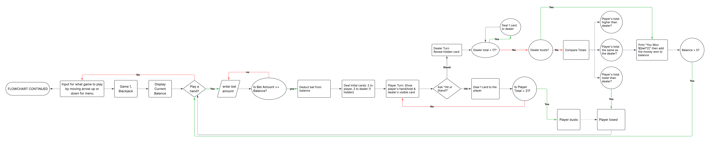

# TerminalGambling
Three gambling games playable in the terminal!

## Requirements
You need to install the library "keyboard" to run the script.
To install, run `pip install keyboard`

## Code Functionality Flowcharts

## Games Included
### Horse Racing (betting)
You scroll the list of horses to bet on, and press enter on the horse you wish to bet on winning. There are different probabilities of the horses winning and higher payouts on the lower probability horses and lower on the higher probability horses. There will be “events” or things that happen in the race every second, with race commentary-like text on screen. After the race, it will display the places each horse got. You will get the payout if the horse got on the podium (top 3).

### Roulette
You to bet on the given numbers, colours, or whether it is odd or even. At the beginning you will select the category by going up or down, with the options being “numbers”, “colours”, “odd/even”, maybe more being added later. In the submenu you’ll just select the options based on what options you are presented with.

### Blackjack
Each round, your goal is to draw cards to try get as close to 21 as possible without going over, and beat the dealer. You have to try to make as much money as possible.

## Save file & Leaderboard
It will save in json format (thats how someone on stackoverflow did it and im yoinking their code) and when you get to $0 or lower, it will just delete the save. It will ask for your name when you open the python file and load and save the amount of money assigned to that name.

Using this local save file, I will display the high score (of money) in the main menu, under the game selection part. The games have shared money so this will be the money from all three games.

### Please note, the save file is local only. Nothing will be saved to the cloud as of now.